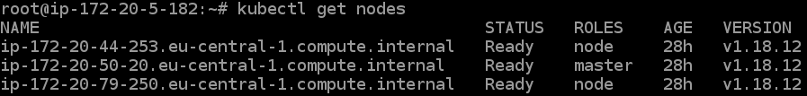
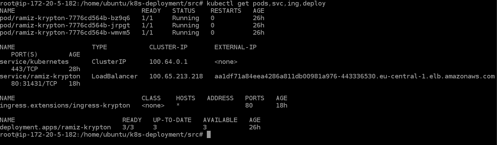
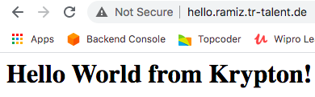

**Deploying a Kubernetes Cluster using KOPS and Terraform and also a sample application using nginx hosted on the K8's cluster.**

**Introduction:**

This README document describes the steps I took while deploying the K8’s cluster and also the sample application.

**Steps involved:**

**1)	Deploying the Infrastructure using Terraform and below are the components provisioned.**

i) A VPC with three subnets(two private in different AZ’s for High Availability) and a single public subnet where the Stepping Stone/Jump server is deployed for deploying and interacting the cluster using kubectl.

ii) Internet Gateway which is attached to the public subnet for installing KOPS,kubectl,aws cli.

iii) NACL & Security Groups which will be attached to the instance.

iv) EC2 instance(Stepping Stone for EKS) which will be provisioned in the public subnet.

v) ECR respository-ramiz-krypton where the application image will be stored.

**2)	Deploying the Kubernetes cluster using KOPS.**

i)	Before installing KOPS, a S3 bucket is required to store the state of the cluster hence I have created-a bucket named kops-statestore.

ii)	Login to the jump server and install  AWS CLI and then execute aws configure and store your AWS Access Key,Secret Access Key  which will be used for authentication.

iii)	Install kubectl--> https://kubernetes.io/docs/tasks/tools/install-kubectl/

iv)	Install KOPS using the below command:
kops create cluster --name=kops.ramiz.tr-talent.de --state=s3://kops-statestore --zones=eu-central-1a,eu-central-1b --node-count=2 --node-size=t3.large --master-size=t3.large --dns-zone=kops.ramiz.tr-talent.de --dns=private --topology=private --networking calico --master-zones=eu-central-1a 

v)	Then update the cluster using below,
kops update cluster --name kops.ramiz.tr-talent.de --yes --state=s3://kops-statestore

vi)	Validate the cluster using kops validate cluster kops.ramiz.tr-talent.de --state=s3://kops-statestore which tells you that your cluster is ready.

vii)	Now it’s time to verify if all the nodes are in running state and yay it’s running:)

**3)	The K8’s cluster is now ready and we can deploy the application.**

i)	ECR Repository(ramiz-krypton) is deployed using Terraform.

ii)	Dockerfile,index.html and nginx conf  files are stored under /home/ubuntu/k8s-deployment/src.

iii)	Navigate to the path and execute the build and push commands which will push your image to the newly create ECR repository.(The commands used are present in the AWS ECR console under push commands section).

iv)	It’s time to deploy the application by creating a Deployment which uses the service and also an ingress which will expose the application publicly.All the codes are present under /home/ubuntu/k8s-deployment/deploy-app.

v)	Use kubectl create –f  /home/ubuntu/k8s-deployment/deploy-app .

vi)	All the objects are now created(Deployments,PODS,services,Ingress).

vii)	You can access the application by using the External IP of the service,in our case it is aa1df71a84eea4286a811db00981a976-443336530.eu-central-1.elb.amazonaws.com which is also the DNS name of the Loadbalancer deployed in the AWS.

viii)	Finally we need to add a domain,I have created a CNAME record with hello.ramiz.tr-talent.de under the public hosted zone ramiz.tr-talent.de pointing to the DNS Name of the Load Balancer and we're done.

BingoO 🥳Congratulations! our application has been successfully deployed on our Kubernetes cluster,you can access it using http://hello.ramiz.tr-talent.de/

